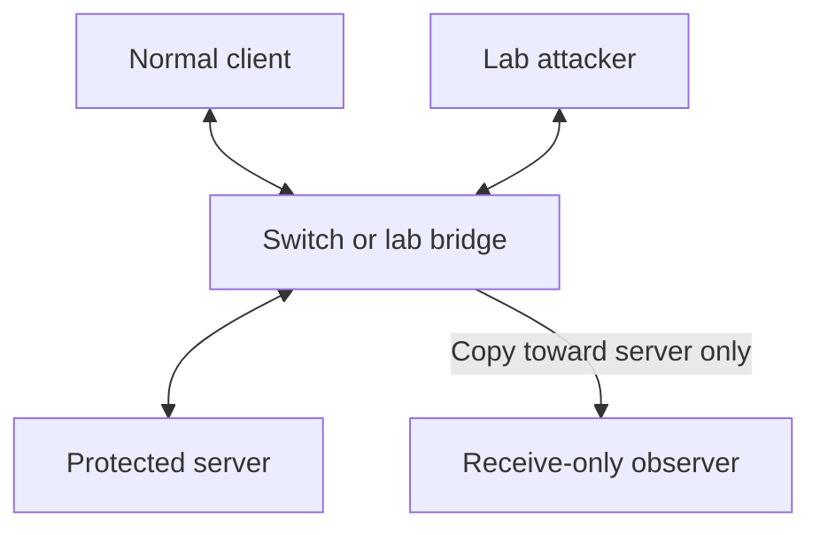

# VEIL architecture and honest detection scope

## What one-way means in this prototype

Your requested mode is **sender -> protected server only**. The bridge copies a frame on the egress hook of its server-facing port. The original continues towards the server. Only the copy goes over a separate veth into a monitor namespace. Server replies enter the bridge in the opposite direction and are not mirrored.

The mirror occurs before delivery into the server namespace. The monitor may receive or process its copy after the server receives the original: scheduling and buffering are independent. An alert is not a prevention/blocking action. No system can promise zero CPU, memory or bandwidth overhead from software mirroring. VEIL adds no application-level dependency to forwarding; measure any latency impact.

The lab has four logical roles: normal client, attacker, server, observer. All can run on one Linux laptop as separate namespaces. Namespace names are `veil-client`, `veil-attacker`, `veil-server`, `veil-monitor`. Their traffic network is 10.77.0.0/24 with no default route.

The monitor interface has no IP address or route. Observer egress is dropped both inside the monitor namespace and at the host end of its capture link. That link is not attached to the bridge. Zeek writes metadata to shared local files; the dashboard backend reads those files in the host namespace. This is a demonstrable software isolation model, not a hardware-enforced diode or a boundary against a compromised host kernel/root account. The file path is shared local storage, not a reverse network channel.

## Physical demonstration with your three machines

Use a managed switch with a supported mirror/SPAN configuration, or a hardware TAP placed upstream of the server. Connect the attacker, normal client and server to that switch. Configure **egress/TX on the server's switch port** as the mirror source (confirm the vendor's RX/TX terminology), and a dedicated receive-only monitor port as the destination. A separate observer machine is the cleanest fourth role; alternatively, a dedicated capture interface and isolated observer VM can host the observer role on an existing machine, with weaker fault isolation. A receive-only adapter/data diode provides physical enforcement.

Three ordinary hosts connected to an unmanaged switch do not automatically provide that mirror. Promiscuous mode on wlan0 cannot capture arbitrary other-machine unicast traffic or place a capture point before the server. Wi-Fi client isolation and virtual switch configuration can also prevent visibility. Do not bridge random laptop NICs as part of setup; the supplied scripts deliberately create virtual lab interfaces only.

## Topology

The observer has no arrow back. In the virtual lab, software drop rules enforce this at the capture link; physical enforcement requires suitable hardware.

## Data path

1. Zeek receives the mirrored IP packets, without opening connections to the senders.
2. `veil.zeek` emits an event immediately for each observed packet and DNS query. It does not wait for `conn.log` connection timeout to detect a flood.
3. The optional official JA4 plugin extracts visible ClientHello metadata. `ja4.zeek` checks new sessions at one-second intervals, for up to six checks. Missing/late ClientHellos stay unavailable; fingerprints are not invented.
4. Python maintains two-second source/destination windows and a bounded recent connection-start history. NumPy computes timing/size statistics; Pandas is used for training data preparation.
5. A scikit-learn RandomForest produces a class vote. Observed evidence supports named suspicions; a model vote without evidence does not create a named attack alert. IsolationForest supplies a separate baseline-calibrated anomaly signal. This is a layered detection pipeline, not literally one mathematical model.
6. SHAP explains the RandomForest vote; anomaly scores and rule evidence are presented separately. Retraining is explicit and requires reviewed data.
7. SHAP explains the random-forest vote; the UI separately lists heuristic evidence. NetworkX maintains recent directed IP relationships. A separate trained directed GraphSAGE module analyzes a bounded 30-second metadata window and supplies supporting node scores and correlation groups to React Flow; see GNN.md.
8. FastAPI sends snapshots over WebSockets every 500ms. React/TypeScript/Tailwind and React Flow render the local analyst interface.
9. PostgreSQL persists alerts and feature windows in the full-stack mode. SQLite is an explicit local demo fallback. At most 10,000 entries per table are retained after cleanup checkpoints; this is a short demonstration retention policy, not immutable forensic custody.
10. PCAP/tcpreplay operates only on a separate isolated replay link. The fast demo replays timestamped metadata, not packets, and the UI labels it.

## Coverage and remaining evidence limits

| Required threat | Implemented evidence | Interpretation / limitation |
|---|---|---|
| Volumetric/protocol DDoS | Per-source and destination-aggregate packet rate, byte rate, SYN fraction, source-IP entropy | Rate/SYN suspicion. No proof that sources are spoofed or replies amplified. Capture loss can hide floods. Destination aggregation alerts at >=500 packets/2 seconds from >=4 source addresses. Entropy is capped to 1,024 tracked sources per destination window. |
| Botnet C2 | At least six distinct connection starts, low interval variation, minimum one-second mean interval | Periodicity suspicion. Periodic benign polling can be identical. Retransmitted SYNs within a UID are deduplicated. |
| DGA / DNS tunnel | DNS first-label entropy, length, TXT fraction | DNS anomaly label, not attribution. Encrypted DNS is not visible; queries must cross the tap towards the observed server. |
| Encrypted malware | Actual JA4 matched against an analyst-maintained local watchlist; IsolationForest size/timing anomalies | A fingerprint is not uniquely malicious. Empty watchlist means no fingerprint-based alert. Live TLS/QUIC plugin integration must be tested with the installed version; QUIC/fragmentation/late ClientHello support is not certified here. |
| Recon / port scan | Destination port diversity per source/server in two seconds | Detects port scans reaching this server. Cannot see a host scan of other servers outside this mirror. |
| Exfiltration | Large observed transfer warning | Server-outbound traffic and outbound/inbound ratio are unavailable in this strict incoming-only mode. Never call this a confirmed exfiltration detector. |

The original PS permits a one-way monitoring feed that contains **both directions of production traffic**. If full exfiltration coverage is required, mirror both production directions into the observer while retaining the one-way observer boundary. This is a different capture scope from the strict sender-to-server mode you requested, not an inline return path.

## Resource and reliability boundaries

- Two-second windows, 100ms tail polling, 500ms UI snapshots; these are design intervals, not a proven end-to-end latency SLA.
- Window capacity 5,000 source/destination pairs; state drops and parse errors are visible. Beacon keys and UID cache are bounded. Recent topology is bounded at 10,000 directed relationships; capacity omissions are reported. One node represents an IP, not a packet. Detection-linked relationships remain visible while their alert is retained.
- JSON log file sizes are not automatically rotated by this prototype. Stop/archive between demos. Retaining one event per packet is a demonstration tradeoff and unsuitable for high-volume production.
- UI/API bind to localhost. This prototype does not include multi-user authentication or Internet deployment. Do not change the bind address without adding those controls.
- No runtime threat-feed lookup, reverse DNS, active scan, mitigation command, or TLS key loading is performed by the observer.
- Processed packet metadata, optional PCAP and IP/DNS values may be sensitive. The demo uses synthetic/local traffic only.
